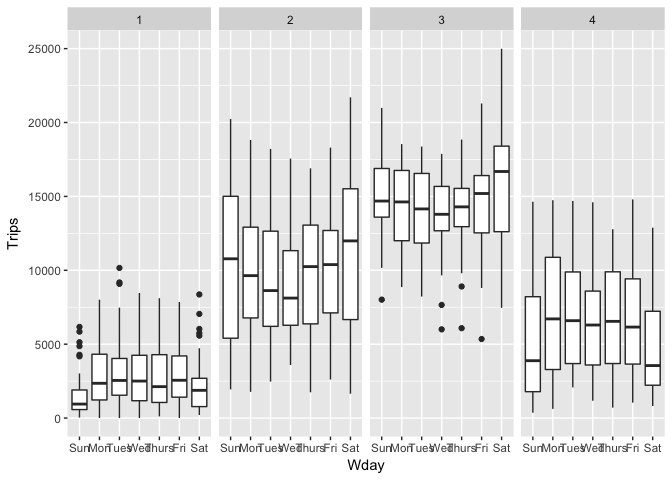
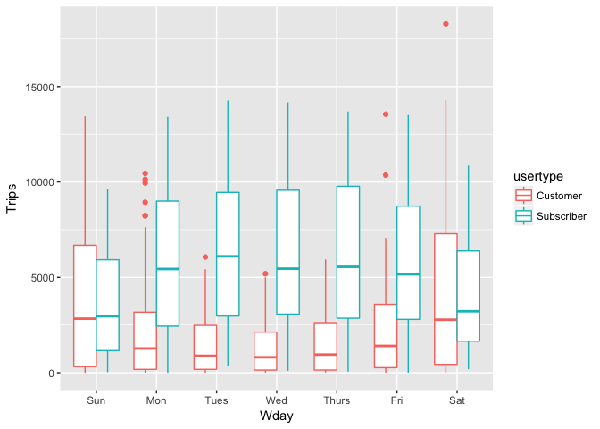
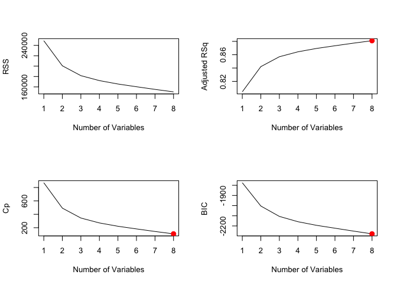
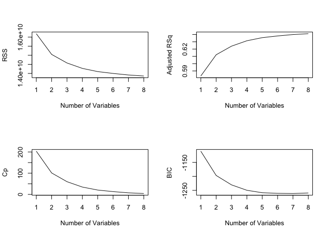
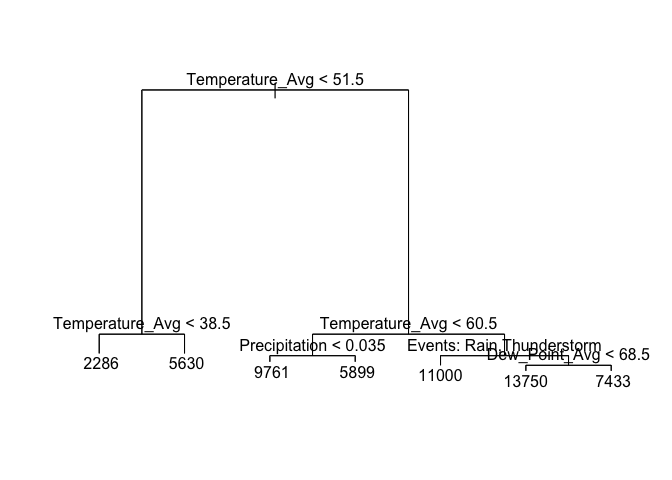
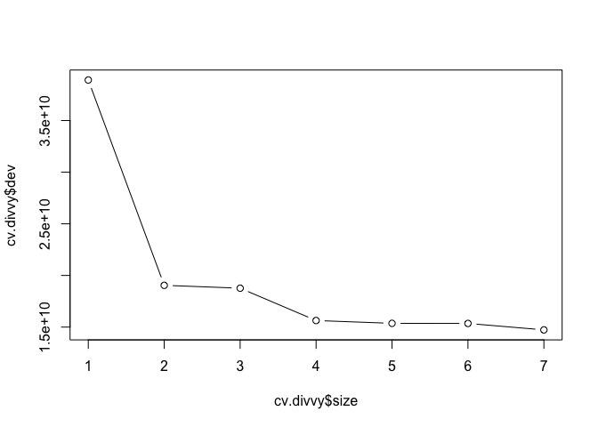
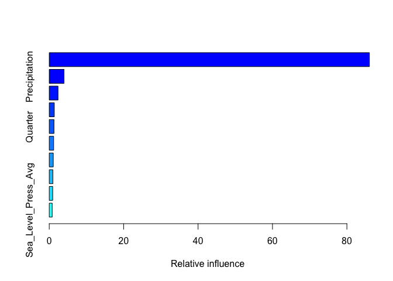
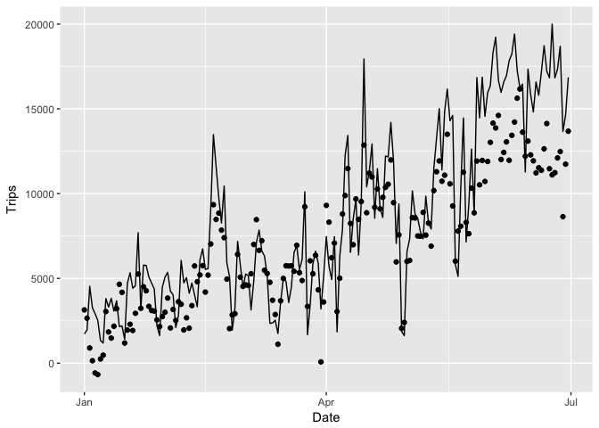
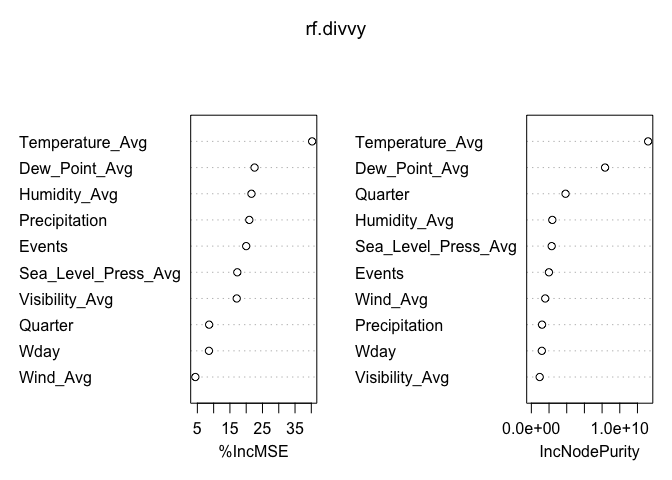
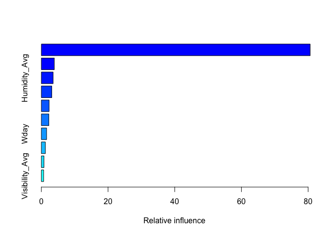

# Divvy
Sungwan Kim  
9/5/2017  


# Introduction

This is a prediction of bicycle sharing usage in the city of Chicago. I have defined the usage as the number of trips taken per day. I will use historical datasets from 2013 to 2016 to predict the usage for the first half of 2017.


## Loading Necessary Packages


```r
library(tidyverse)
```

```
## Loading tidyverse: ggplot2
## Loading tidyverse: tibble
## Loading tidyverse: tidyr
## Loading tidyverse: readr
## Loading tidyverse: purrr
## Loading tidyverse: dplyr
```

```
## Conflicts with tidy packages ----------------------------------------------
```

```
## filter(): dplyr, stats
## lag():    dplyr, stats
```

```r
library(lubridate)
```

```
## 
## Attaching package: 'lubridate'
```

```
## The following object is masked from 'package:base':
## 
##     date
```

```r
library(leaps)
library(tree)
library(randomForest)
```

```
## randomForest 4.6-12
```

```
## Type rfNews() to see new features/changes/bug fixes.
```

```
## 
## Attaching package: 'randomForest'
```

```
## The following object is masked from 'package:dplyr':
## 
##     combine
```

```
## The following object is masked from 'package:ggplot2':
## 
##     margin
```

```r
library(party)
```

```
## Loading required package: grid
```

```
## Loading required package: mvtnorm
```

```
## Loading required package: modeltools
```

```
## Loading required package: stats4
```

```
## Loading required package: strucchange
```

```
## Loading required package: zoo
```

```
## 
## Attaching package: 'zoo'
```

```
## The following objects are masked from 'package:base':
## 
##     as.Date, as.Date.numeric
```

```
## Loading required package: sandwich
```

```r
library(gbm)
```

```
## Loading required package: survival
```

```
## Loading required package: lattice
```

```
## Loading required package: splines
```

```
## Loading required package: parallel
```

```
## Loaded gbm 2.1.3
```

## Importing Data

First I will combine all the trips dataset into one data frame. Divvy trips for 2013 is imported separately since it is formatted somewhat differently. Birthday variable is renamed as birthyear as it is birthyear in all other datasets. We convert starttime and stoptime into date format.
 

```r
trips_2013 <- read_csv("Divvy_Trips_2013.csv")
```

```
## Parsed with column specification:
## cols(
##   trip_id = col_integer(),
##   starttime = col_datetime(format = ""),
##   stoptime = col_datetime(format = ""),
##   bikeid = col_integer(),
##   tripduration = col_integer(),
##   from_station_id = col_integer(),
##   from_station_name = col_character(),
##   to_station_id = col_integer(),
##   to_station_name = col_character(),
##   usertype = col_character(),
##   gender = col_character(),
##   birthday = col_character()
## )
```

```r
names(trips_2013)[names(trips_2013) == "birthday"] <- "birthyear"
trips_2013$starttime <- as_date(trips_2013$starttime)
trips_2013$stoptime <- as_date(trips_2013$stoptime)
```

Again, we import other datsets excluding quarter 3 and 4 in 2016 since the starttime and stoptime is formatted differently. We combine these datasets using row bind and convert dates.


```r
trips_2014_Q1Q2 <- read_csv("Divvy_Trips_2014_Q1Q2.csv")
```

```
## Parsed with column specification:
## cols(
##   trip_id = col_integer(),
##   starttime = col_character(),
##   stoptime = col_character(),
##   bikeid = col_integer(),
##   tripduration = col_integer(),
##   from_station_id = col_integer(),
##   from_station_name = col_character(),
##   to_station_id = col_integer(),
##   to_station_name = col_character(),
##   usertype = col_character(),
##   gender = col_character(),
##   birthyear = col_integer()
## )
```

```r
trips_2014_Q3_07 <- read_csv("Divvy_Trips_2014-Q3-07.csv")
```

```
## Parsed with column specification:
## cols(
##   trip_id = col_integer(),
##   starttime = col_character(),
##   stoptime = col_character(),
##   bikeid = col_integer(),
##   tripduration = col_integer(),
##   from_station_id = col_integer(),
##   from_station_name = col_character(),
##   to_station_id = col_integer(),
##   to_station_name = col_character(),
##   usertype = col_character(),
##   gender = col_character(),
##   birthyear = col_integer()
## )
```

```r
trips_2014_Q3_0809 <- read_csv("Divvy_Trips_2014-Q3-0809.csv")
```

```
## Parsed with column specification:
## cols(
##   trip_id = col_integer(),
##   starttime = col_character(),
##   stoptime = col_character(),
##   bikeid = col_integer(),
##   tripduration = col_integer(),
##   from_station_id = col_integer(),
##   from_station_name = col_character(),
##   to_station_id = col_integer(),
##   to_station_name = col_character(),
##   usertype = col_character(),
##   gender = col_character(),
##   birthyear = col_integer()
## )
```

```r
trips_2014_Q4 <- read_csv("Divvy_Trips_2014-Q4.csv")
```

```
## Parsed with column specification:
## cols(
##   trip_id = col_integer(),
##   starttime = col_character(),
##   stoptime = col_character(),
##   bikeid = col_integer(),
##   tripduration = col_integer(),
##   from_station_id = col_integer(),
##   from_station_name = col_character(),
##   to_station_id = col_integer(),
##   to_station_name = col_character(),
##   usertype = col_character(),
##   gender = col_character(),
##   birthyear = col_integer()
## )
```

```r
trips_2015_Q1 <- read_csv("Divvy_Trips_2015-Q1.csv")
```

```
## Parsed with column specification:
## cols(
##   trip_id = col_integer(),
##   starttime = col_character(),
##   stoptime = col_character(),
##   bikeid = col_integer(),
##   tripduration = col_integer(),
##   from_station_id = col_integer(),
##   from_station_name = col_character(),
##   to_station_id = col_integer(),
##   to_station_name = col_character(),
##   usertype = col_character(),
##   gender = col_character(),
##   birthyear = col_integer()
## )
```

```r
trips_2015_Q2 <- read_csv("Divvy_Trips_2015-Q2.csv")
```

```
## Parsed with column specification:
## cols(
##   trip_id = col_integer(),
##   starttime = col_character(),
##   stoptime = col_character(),
##   bikeid = col_integer(),
##   tripduration = col_integer(),
##   from_station_id = col_integer(),
##   from_station_name = col_character(),
##   to_station_id = col_integer(),
##   to_station_name = col_character(),
##   usertype = col_character(),
##   gender = col_character(),
##   birthyear = col_integer()
## )
```

```r
trips_2015_Q3_07 <- read_csv("Divvy_Trips_2015_07.csv")
```

```
## Parsed with column specification:
## cols(
##   trip_id = col_integer(),
##   starttime = col_character(),
##   stoptime = col_character(),
##   bikeid = col_integer(),
##   tripduration = col_integer(),
##   from_station_id = col_integer(),
##   from_station_name = col_character(),
##   to_station_id = col_integer(),
##   to_station_name = col_character(),
##   usertype = col_character(),
##   gender = col_character(),
##   birthyear = col_integer()
## )
```

```r
trips_2015_Q3_08 <- read_csv("Divvy_Trips_2015_08.csv")
```

```
## Parsed with column specification:
## cols(
##   trip_id = col_integer(),
##   starttime = col_character(),
##   stoptime = col_character(),
##   bikeid = col_integer(),
##   tripduration = col_integer(),
##   from_station_id = col_integer(),
##   from_station_name = col_character(),
##   to_station_id = col_integer(),
##   to_station_name = col_character(),
##   usertype = col_character(),
##   gender = col_character(),
##   birthyear = col_integer()
## )
```

```r
trips_2015_Q3_09 <- read_csv("Divvy_Trips_2015_09.csv")
```

```
## Parsed with column specification:
## cols(
##   trip_id = col_integer(),
##   starttime = col_character(),
##   stoptime = col_character(),
##   bikeid = col_integer(),
##   tripduration = col_integer(),
##   from_station_id = col_integer(),
##   from_station_name = col_character(),
##   to_station_id = col_integer(),
##   to_station_name = col_character(),
##   usertype = col_character(),
##   gender = col_character(),
##   birthyear = col_integer()
## )
```

```r
trips_2015_Q4 <- read_csv("Divvy_Trips_2015_Q4.csv")
```

```
## Parsed with column specification:
## cols(
##   trip_id = col_integer(),
##   starttime = col_character(),
##   stoptime = col_character(),
##   bikeid = col_integer(),
##   tripduration = col_integer(),
##   from_station_id = col_integer(),
##   from_station_name = col_character(),
##   to_station_id = col_integer(),
##   to_station_name = col_character(),
##   usertype = col_character(),
##   gender = col_character(),
##   birthyear = col_integer()
## )
```

```r
trips_2016_Q1 <- read_csv("Divvy_Trips_2016_Q1.csv")
```

```
## Parsed with column specification:
## cols(
##   trip_id = col_integer(),
##   starttime = col_character(),
##   stoptime = col_character(),
##   bikeid = col_integer(),
##   tripduration = col_integer(),
##   from_station_id = col_integer(),
##   from_station_name = col_character(),
##   to_station_id = col_integer(),
##   to_station_name = col_character(),
##   usertype = col_character(),
##   gender = col_character(),
##   birthyear = col_integer()
## )
```

```r
trips_2016_Q2_04 <- read_csv("Divvy_Trips_2016_04.csv")
```

```
## Parsed with column specification:
## cols(
##   trip_id = col_integer(),
##   starttime = col_character(),
##   stoptime = col_character(),
##   bikeid = col_integer(),
##   tripduration = col_integer(),
##   from_station_id = col_integer(),
##   from_station_name = col_character(),
##   to_station_id = col_integer(),
##   to_station_name = col_character(),
##   usertype = col_character(),
##   gender = col_character(),
##   birthyear = col_integer()
## )
```

```r
trips_2016_Q2_05 <- read_csv("Divvy_Trips_2016_05.csv")
```

```
## Parsed with column specification:
## cols(
##   trip_id = col_integer(),
##   starttime = col_character(),
##   stoptime = col_character(),
##   bikeid = col_integer(),
##   tripduration = col_integer(),
##   from_station_id = col_integer(),
##   from_station_name = col_character(),
##   to_station_id = col_integer(),
##   to_station_name = col_character(),
##   usertype = col_character(),
##   gender = col_character(),
##   birthyear = col_integer()
## )
```

```r
trips_2016_Q2_06 <- read_csv("Divvy_Trips_2016_06.csv")
```

```
## Parsed with column specification:
## cols(
##   trip_id = col_integer(),
##   starttime = col_character(),
##   stoptime = col_character(),
##   bikeid = col_integer(),
##   tripduration = col_integer(),
##   from_station_id = col_integer(),
##   from_station_name = col_character(),
##   to_station_id = col_integer(),
##   to_station_name = col_character(),
##   usertype = col_character(),
##   gender = col_character(),
##   birthyear = col_integer()
## )
```

```r
trips <- rbind(trips_2014_Q1Q2, trips_2014_Q3_07, trips_2014_Q3_0809, trips_2014_Q4, 
               trips_2015_Q1, trips_2015_Q2, trips_2015_Q3_07, trips_2015_Q3_08,
               trips_2015_Q3_09, trips_2015_Q4, trips_2016_Q1, trips_2016_Q2_04,
               trips_2016_Q2_05, trips_2016_Q2_06)
trips$starttime <- as_date(mdy_hm(trips$starttime))
trips$stoptime <- as_date(mdy_hm(trips$stoptime))
```

Lastly, we do appropriate date conversion for Q3 and Q4 and combined all together into one data frame.


```r
trips_2016_Q3 <- read_csv("Divvy_Trips_2016_Q3.csv")
```

```
## Parsed with column specification:
## cols(
##   trip_id = col_integer(),
##   starttime = col_character(),
##   stoptime = col_character(),
##   bikeid = col_integer(),
##   tripduration = col_integer(),
##   from_station_id = col_integer(),
##   from_station_name = col_character(),
##   to_station_id = col_integer(),
##   to_station_name = col_character(),
##   usertype = col_character(),
##   gender = col_character(),
##   birthyear = col_integer()
## )
```

```r
trips_2016_Q4 <- read_csv("Divvy_Trips_2016_Q4.csv")
```

```
## Parsed with column specification:
## cols(
##   trip_id = col_integer(),
##   starttime = col_character(),
##   stoptime = col_character(),
##   bikeid = col_integer(),
##   tripduration = col_integer(),
##   from_station_id = col_integer(),
##   from_station_name = col_character(),
##   to_station_id = col_integer(),
##   to_station_name = col_character(),
##   usertype = col_character(),
##   gender = col_character(),
##   birthyear = col_integer()
## )
```

```r
trips_2016_Q3Q4 <- rbind(trips_2016_Q3, trips_2016_Q4)
trips_2016_Q3Q4$starttime <- as_date(mdy_hms(trips_2016_Q3Q4$starttime))
trips_2016_Q3Q4$stoptime <- as_date(mdy_hms(trips_2016_Q3Q4$stoptime))
trips <- rbind(trips_2013, trips, trips_2016_Q3Q4)
```

Now, in order to get the usage value, we have to first group the number of trips taken by date. There are two options available for date to sum over - start time and stop time. There are 'r trips$starttime != trips$stoptime' instances where start time are different from the stop time. Since this is comparatively small percentage, we will use start time to sum together trips.

## Exploratory Data Analysis

Let's shed more light into what is driving the Divvy usage. First, I will define usage to be the number of trips taken per day.


```r
names(trips)[names(trips) == "starttime"] <- "Date"
byday <- trips %>%
  group_by(Date) %>% 
  summarise(Trips = n())
ggplot(byday, aes(Date, Trips)) + geom_line()
```

<!-- -->

The graph shows strong seasonal pattern of usage. I will create a variable called quarter to account for this pattern when predicting.


```r
byday$Quarter <- 1
byday$Quarter[month(byday$Date) %in% 4:6] <- 2
byday$Quarter[month(byday$Date) %in% 7:9] <- 3
byday$Quarter[month(byday$Date) %in% 10:12] <- 4
byday$Quarter <- as.factor(byday$Quarter)
```


I will compute day of the week variable to see the shorter usage pattern.


```r
byday <- byday %>% 
  mutate(Wday = wday(Date, label = TRUE))
ggplot(byday, aes(Wday, Trips)) + geom_boxplot()
```

<!-- -->

It seems like usage during week days are little higher than usage during weekends. This pattern is more pronounced when usage is divided between different user types.


```r
trips[trips$usertype == "Dependent",]$usertype <- "Subscriber"
byday2 <- trips %>% 
  group_by(Date, usertype) %>% 
  summarise(Trips = n()) %>% 
  mutate(Wday = wday(Date, label = TRUE))
ggplot(byday2, aes(Wday, Trips, color = usertype)) + geom_boxplot()
```

<!-- -->

Now, let's take a look at weather data.


```r
weather <- read_csv("chicagoweather.csv")
```

```
## Parsed with column specification:
## cols(
##   .default = col_integer(),
##   Date = col_character(),
##   Sea_Level_Press_High = col_double(),
##   Sea_Level_Press_Avg = col_double(),
##   Sea_Level_Press_Low = col_double(),
##   Wind_High = col_character(),
##   Precipitation = col_character(),
##   Events = col_character()
## )
```

```
## See spec(...) for full column specifications.
```

```r
weather$Date <- as_date(dmy(weather$Date))
weather$Precipitation[weather$Precipitation == "T"] <- 0
weather$Precipitation <- as.numeric(weather$Precipitation)
weather[which(is.na(weather$Events)),]$Events <- "None"
weather$Events <- as.factor(weather$Events)
levels(weather$Events)
```

```
##  [1] "Fog"                               
##  [2] "Fog\r\t,\rRain"                    
##  [3] "Fog\r\t,\rRain\r\t,\rSnow"         
##  [4] "Fog\r\t,\rRain\r\t,\rThunderstorm" 
##  [5] "Fog\r\t,\rSnow"                    
##  [6] "None"                              
##  [7] "Rain"                              
##  [8] "Rain\r\t,\rHail\r\t,\rThunderstorm"
##  [9] "Rain\r\t,\rSnow"                   
## [10] "Rain\r\t,\rThunderstorm"           
## [11] "Snow"                              
## [12] "Thunderstorm"
```

```r
weather$Events <- gsub("Fog|Fog\\r\\t,\\rRain|Rain", "Rain", weather$Events)
weather$Events <- gsub("Fog\\r\\t,\\rRain\\r\\t,\\rSnow|Fog\\r\\t,\\rSnow|Rain\\r\\t,\\rSnow|Snow", "Snow", weather$Events)
weather$Events <- gsub("Fog\\r\\t,\\rRain\\r\\t,\\rThunderstorm|Rain\\r\\t,\\rHail\\r\\t,\\rThunderstorm|Rain\\r\\t,\\rThunderstorm|Thunderstorm", "Thunderstorm", weather$Events)
weather$Events <- as.factor(weather$Events)
levels(weather$Events)
```

```
## [1] "None"         "Rain"         "Snow"         "Thunderstorm"
```

Now we are ready to merge and create our training dataset!


```r
train <- weather %>% 
  left_join(byday, by = "Date")
```

There are few missing values in our training data set. These are from the days when there were no trips, so we will input the adequate values accordingly.


```r
train[which(is.na(train$Trips)),]
```

```
## # A tibble: 2 x 24
##         Date Temperature_High Temperature_Avg Temperature_Low
##       <date>            <int>           <int>           <int>
## 1 2014-01-07                3              -4             -12
## 2 2014-01-08               17               6              -6
## # ... with 20 more variables: Dew_Point_High <int>, Dew_Point_Avg <int>,
## #   Dew_Point_Low <int>, Humidity_High <int>, Humidity_Avg <int>,
## #   Humidity_Low <int>, Sea_Level_Press_High <dbl>,
## #   Sea_Level_Press_Avg <dbl>, Sea_Level_Press_Low <dbl>,
## #   Visibility_High <int>, Visibility_Avg <int>, Visibility_Low <int>,
## #   Wind_Avg <int>, Wind_Low <int>, Wind_High <chr>, Precipitation <dbl>,
## #   Events <fctr>, Trips <int>, Quarter <fctr>, Wday <ord>
```

```r
which(is.na(train$Trips))
```

```
## [1] 195 196
```

```r
train[195, "Wday"] <- "Tues"
train[196, "Wday"] <- "Wed"
train[which(is.na(train$Quarter)),]$Quarter <- 1
train[which(is.na(train$Trips)),]$Trips <- 0
```

## Test

Now we do the same transformation to trips and weather data for 2017 to create our testing set.


```r
weather_2017 <- read_csv("chicagoweather2017.csv")
```

```
## Parsed with column specification:
## cols(
##   .default = col_integer(),
##   Date = col_character(),
##   Sea_Level_Press_High = col_double(),
##   Sea_Level_Press_Avg = col_double(),
##   Sea_Level_Press_Low = col_double(),
##   Wind_High = col_character(),
##   Precipitation = col_double(),
##   Events = col_character()
## )
```

```
## See spec(...) for full column specifications.
```

```r
weather_2017$Date <- as_date(dmy(weather_2017$Date))
weather_2017[which(is.na(weather_2017$Precipitation)),]$Precipitation <- 0
weather_2017$Precipitation <- as.numeric(weather_2017$Precipitation)
weather_2017[which(is.na(weather_2017$Events)),]$Events <- "None"
weather_2017$Events <- as.factor(weather_2017$Events)
levels(weather_2017$Events)
```

```
##  [1] "Fog"                        "Fog , Rain"                
##  [3] "Fog , Rain , Snow"          "Fog , Rain , Thunderstorm" 
##  [5] "Fog , Snow"                 "Fog , Snow , Thunderstorm" 
##  [7] "None"                       "Rain"                      
##  [9] "Rain , Hail , Thunderstorm" "Rain , Snow"               
## [11] "Rain , Thunderstorm"        "Snow"                      
## [13] "Thunderstorm"
```

```r
weather_2017$Events <- gsub("Fog|Fog , Rain|Rain", "Rain", weather_2017$Events)
weather_2017$Events <- gsub("Fog , Rain , Snow|Fog , Snow|Rain , Snow|Snow", "Snow", weather_2017$Events)
weather_2017$Events <- gsub("Fog , Rain , Thunderstorm|Fog , Snow , Thunderstorm|Rain , Hail , Thunderstorm|Rain , Thunderstorm|Thunderstorm|Snow , Thunderstorm", "Thunderstorm", weather_2017$Events)
weather_2017$Events <- as.factor(weather_2017$Events)
levels(weather_2017$Events)
```

```
## [1] "None"         "Rain"         "Snow"         "Thunderstorm"
```

```r
trips_2017_Q1 <- read_csv("Divvy_Trips_2017_Q1.csv")
```

```
## Parsed with column specification:
## cols(
##   trip_id = col_integer(),
##   start_time = col_character(),
##   end_time = col_character(),
##   bikeid = col_integer(),
##   tripduration = col_integer(),
##   from_station_id = col_integer(),
##   from_station_name = col_character(),
##   to_station_id = col_integer(),
##   to_station_name = col_character(),
##   usertype = col_character(),
##   gender = col_character(),
##   birthyear = col_integer()
## )
```

```r
trips_2017_Q2 <- read_csv("Divvy_Trips_2017_Q2.csv")
```

```
## Parsed with column specification:
## cols(
##   trip_id = col_integer(),
##   start_time = col_character(),
##   end_time = col_character(),
##   bikeid = col_integer(),
##   tripduration = col_integer(),
##   from_station_id = col_integer(),
##   from_station_name = col_character(),
##   to_station_id = col_integer(),
##   to_station_name = col_character(),
##   usertype = col_character(),
##   gender = col_character(),
##   birthyear = col_integer()
## )
```

```r
trips_2017 <- rbind(trips_2017_Q1, trips_2017_Q2)

trips_2017$Date <- as_date(mdy_hms(trips_2017$start_time))
byday3 <- trips_2017 %>% 
  group_by(Date) %>% 
  summarise(Trips = n()) %>% 
  mutate(Wday = wday(Date, label = TRUE))

byday3$Quarter <- 1
byday3$Quarter[month(byday3$Date) %in% 4:6] <- 2
byday3$Quarter[month(byday3$Date) %in% 7:9] <- 3
byday3$Quarter[month(byday3$Date) %in% 10:12] <- 4
byday3$Quarter <- as.factor(byday3$Quarter)
levels(byday3$Quarter) <- levels(byday3$Quarter)

test <- weather_2017 %>% 
  left_join(byday3, by = "Date")
```

## Model

### Linear Regression

I will first use linear regression as a starting point and a benchmark.


```r
lm.fit <- lm(Trips ~ Temperature_Avg + Dew_Point_Avg + Humidity_Avg + Sea_Level_Press_Avg + Visibility_Avg + Wind_Avg + Precipitation + Events + Wday + Quarter, train)
summary(lm.fit)
```

```
## 
## Call:
## lm(formula = Trips ~ Temperature_Avg + Dew_Point_Avg + Humidity_Avg + 
##     Sea_Level_Press_Avg + Visibility_Avg + Wind_Avg + Precipitation + 
##     Events + Wday + Quarter, data = train)
## 
## Residuals:
##      Min       1Q   Median       3Q      Max 
## -14302.5  -1595.2    246.5   2038.3  12717.5 
## 
## Coefficients:
##                       Estimate Std. Error t value Pr(>|t|)    
## (Intercept)         -44877.828  18406.578  -2.438 0.014900 *  
## Temperature_Avg        199.093     45.808   4.346 1.50e-05 ***
## Dew_Point_Avg            9.942     48.536   0.205 0.837737    
## Humidity_Avg           -37.028     23.483  -1.577 0.115088    
## Sea_Level_Press_Avg   1507.258    595.811   2.530 0.011535 *  
## Visibility_Avg          46.931     78.253   0.600 0.548785    
## Wind_Avg               -45.207     19.102  -2.367 0.018104 *  
## Precipitation        -1686.277    460.927  -3.658 0.000264 ***
## EventsRain           -1229.719    274.144  -4.486 7.93e-06 ***
## EventsSnow             158.947    356.963   0.445 0.656196    
## EventsThunderstorm   -1198.340    411.669  -2.911 0.003667 ** 
## Wday.L                 300.759    244.585   1.230 0.219050    
## Wday.Q                -210.359    245.145  -0.858 0.391001    
## Wday.C                 261.868    244.248   1.072 0.283862    
## Wday^4                -185.011    244.948  -0.755 0.450207    
## Wday^5                -135.976    244.785  -0.555 0.578657    
## Wday^6                 -26.171    244.211  -0.107 0.914674    
## Quarter2               999.217    394.908   2.530 0.011519 *  
## Quarter3               467.196    453.912   1.029 0.303551    
## Quarter4               160.943    300.843   0.535 0.592764    
## ---
## Signif. codes:  0 '***' 0.001 '**' 0.01 '*' 0.05 '.' 0.1 ' ' 1
## 
## Residual standard error: 3303 on 1264 degrees of freedom
## Multiple R-squared:  0.6451,	Adjusted R-squared:  0.6397 
## F-statistic: 120.9 on 19 and 1264 DF,  p-value: < 2.2e-16
```

The model has found temperature, sea level pressure, wind, precipitation, rain, thunderstorm, and quarter2 to be significant. The model has R-squared of 0.6451 which means 64.51% of the trips are explained by this data. So, how did our model do in terms of prediction? 


```r
sqrt(mean((test$Trips - predict(lm.fit, test))^2))
```

```
## [1] 2583.261
```

The linear model has a root mean squared error(RMSE) of 2583.261. I have used RMSE for a metric to evaluate the prediction accuracy. Now let's plot the predicted value along with the actual value. 


```r
test$yhat <- predict(lm.fit, test)
graph <- ggplot(test) + 
  geom_line(aes(Date, Trips)) +
  geom_point(aes(Date, yhat))
graph
```

<!-- -->

We might want to have an interaction term between variables wday and quarter as it might be more reasonable to assume that usage differ by weekdays for different quarters and vice versa. 


```r
lm.fit2 <- lm(Trips ~ Temperature_Avg + Dew_Point_Avg + Humidity_Avg + Sea_Level_Press_Avg + Visibility_Avg + Wind_Avg + Precipitation + Events + Wday * Quarter, train)
summary(lm.fit2)
```

```
## 
## Call:
## lm(formula = Trips ~ Temperature_Avg + Dew_Point_Avg + Humidity_Avg + 
##     Sea_Level_Press_Avg + Visibility_Avg + Wind_Avg + Precipitation + 
##     Events + Wday * Quarter, data = train)
## 
## Residuals:
##      Min       1Q   Median       3Q      Max 
## -13687.5  -1500.5    210.7   1933.9  11312.9 
## 
## Coefficients:
##                       Estimate Std. Error t value Pr(>|t|)    
## (Intercept)         -50393.732  18344.604  -2.747 0.006100 ** 
## Temperature_Avg        203.897     45.830   4.449 9.40e-06 ***
## Dew_Point_Avg            7.896     48.561   0.163 0.870860    
## Humidity_Avg           -36.255     23.450  -1.546 0.122340    
## Sea_Level_Press_Avg   1687.671    593.397   2.844 0.004527 ** 
## Visibility_Avg          33.123     78.095   0.424 0.671540    
## Wind_Avg               -41.915     19.030  -2.203 0.027809 *  
## Precipitation        -1625.201    458.064  -3.548 0.000403 ***
## EventsRain           -1248.264    273.386  -4.566 5.46e-06 ***
## EventsSnow             154.050    354.527   0.435 0.663985    
## EventsThunderstorm   -1258.183    410.448  -3.065 0.002221 ** 
## Wday.L                -123.292    525.976  -0.234 0.814709    
## Wday.Q               -1687.087    527.432  -3.199 0.001415 ** 
## Wday.C                 309.168    526.314   0.587 0.557028    
## Wday^4                -267.121    527.047  -0.507 0.612367    
## Wday^5                -161.398    526.853  -0.306 0.759394    
## Wday^6                -102.379    528.711  -0.194 0.846491    
## Quarter2               924.217    391.272   2.362 0.018326 *  
## Quarter3               378.528    449.761   0.842 0.400162    
## Quarter4               120.698    297.779   0.405 0.685308    
## Wday.L:Quarter2        852.667    738.963   1.154 0.248775    
## Wday.Q:Quarter2       2017.970    742.074   2.719 0.006632 ** 
## Wday.C:Quarter2        -28.829    742.716  -0.039 0.969044    
## Wday^4:Quarter2        320.008    741.921   0.431 0.666308    
## Wday^5:Quarter2        153.500    741.615   0.207 0.836058    
## Wday^6:Quarter2        254.168    742.322   0.342 0.732111    
## Wday.L:Quarter3       1021.037    696.192   1.467 0.142737    
## Wday.Q:Quarter3       3493.253    695.056   5.026 5.74e-07 ***
## Wday.C:Quarter3       -338.270    693.919  -0.487 0.626006    
## Wday^4:Quarter3        441.326    693.420   0.636 0.524601    
## Wday^5:Quarter3         12.338    692.733   0.018 0.985793    
## Wday^6:Quarter3         54.758    695.330   0.079 0.937243    
## Wday.L:Quarter4       -186.103    695.124  -0.268 0.788955    
## Wday.Q:Quarter4        129.380    694.588   0.186 0.852265    
## Wday.C:Quarter4        209.918    694.235   0.302 0.762418    
## Wday^4:Quarter4       -376.654    694.994  -0.542 0.587948    
## Wday^5:Quarter4        -50.417    693.310  -0.073 0.942041    
## Wday^6:Quarter4         17.019    696.723   0.024 0.980516    
## ---
## Signif. codes:  0 '***' 0.001 '**' 0.01 '*' 0.05 '.' 0.1 ' ' 1
## 
## Residual standard error: 3268 on 1246 degrees of freedom
## Multiple R-squared:  0.6576,	Adjusted R-squared:  0.6474 
## F-statistic: 64.67 on 37 and 1246 DF,  p-value: < 2.2e-16
```

Calculating the RMSE of the second model.


```r
sqrt(mean((test$Trips - predict(lm.fit2, test))^2))
```

```
## [1] 2534.229
```

We did a little better in terms of the prediction. Now, let's see if using all the features is the right way to run the regression. There might be issue of multicollinearity between weather variables as they are likely to be highly correlated.


```r
regfit.full <- regsubsets(Trips ~ Temperature_Avg + Dew_Point_Avg + Humidity_Avg + Sea_Level_Press_Avg + Visibility_Avg + Wind_Avg + Precipitation + Events + Wday + Quarter, train)
reg.summary <- summary(regfit.full)
reg.summary$rsq
```

```
## [1] 0.5833729 0.6127635 0.6248795 0.6325450 0.6370794 0.6396962 0.6418824
## [8] 0.6433455
```

```r
par(mfrow=c(2,2))
plot(reg.summary$rss,xlab="Number of Variables",ylab="RSS",type="l")
plot(reg.summary$adjr2,xlab="Number of Variables",ylab="Adjusted RSq",type="l")
which.max(reg.summary$adjr2)
```

```
## [1] 8
```

```r
plot(reg.summary$cp,xlab="Number of Variables",ylab="Cp",type="l")
which.min(reg.summary$cp)
```

```
## [1] 8
```

```r
plot(reg.summary$bic,xlab="Number of Variables",ylab="BIC",type="l")
```

<!-- -->

```r
which.min(reg.summary$bic)
```

```
## [1] 7
```

It seems like using all 8 regressors is the right way to go.

### Decision Tree

Next, we will use decision tree to predict the usage.


```r
set.seed(11)
tree.divvy <- tree(Trips ~ Temperature_Avg + Dew_Point_Avg + Humidity_Avg + Sea_Level_Press_Avg + Visibility_Avg + Wind_Avg + Precipitation + Events + Wday + Quarter, train)
summary(tree.divvy)
```

```
## 
## Regression tree:
## tree(formula = Trips ~ Temperature_Avg + Dew_Point_Avg + Humidity_Avg + 
##     Sea_Level_Press_Avg + Visibility_Avg + Wind_Avg + Precipitation + 
##     Events + Wday + Quarter, data = train)
## Variables actually used in tree construction:
## [1] "Temperature_Avg" "Precipitation"   "Events"          "Dew_Point_Avg"  
## Number of terminal nodes:  7 
## Residual mean deviance:  10580000 = 1.352e+10 / 1277 
## Distribution of residuals:
##      Min.   1st Qu.    Median      Mean   3rd Qu.      Max. 
## -12550.00  -1498.00     58.17      0.00   1993.00  11240.00
```

```r
par(mfrow=c(1, 1))
plot(tree.divvy)
text(tree.divvy, pretty = 0)
```

<!-- -->

```r
cv.divvy <- cv.tree(tree.divvy)
plot(cv.divvy$size, cv.divvy$dev, type='b')
```

<!-- -->

How did we do in terms of prediction?


```r
sqrt(mean((predict(tree.divvy, newdata = test) - test$Trips)^2))
```

```
## [1] 2833.867
```

We actually did worse than linear model. We can reconcile this issue with using ensemble modeling. Before we move on, let's take a look at the predicted value.


```r
test$yhat <- predict(tree.divvy, newdata = test)
graph
```

<!-- -->

### Bagging and Random Forest


```r
combi <- rbind(train, test[,-25])
train <- combi[1:1284,]
test <- combi[1285:1465,]
```

Instead of using decision trees, we can use many trees to predict the usage. Bagging model is a special case of random forest when we use all the features available.


```r
set.seed(11)
bag.divvy <- randomForest(Trips ~ Temperature_Avg + Dew_Point_Avg + Humidity_Avg + Sea_Level_Press_Avg + Visibility_Avg + Wind_Avg + Precipitation + Events + Wday + Quarter, train, mtry=9, importance=TRUE)
```

Let's see how we did.


```r
sqrt(mean((predict(bag.divvy, newdata = test) - test$Trips)^2))
```

```
## [1] 2622.571
```

We did a little better than decision tree, but it is still less accurate than linear regression.


```r
test$yhat <- predict(bag.divvy, newdata = test)
graph
```

<!-- -->

Now we use random forest. The default is using square root of features in this case 3.


```r
rf.divvy <- randomForest(Trips ~ Temperature_Avg + Dew_Point_Avg + Humidity_Avg + Sea_Level_Press_Avg + Visibility_Avg + Wind_Avg + Precipitation + Events + Wday + Quarter, train, mtry=3, importance=TRUE)
importance(rf.divvy)
```

```
##                       %IncMSE IncNodePurity
## Temperature_Avg     40.252717   13207305137
## Dew_Point_Avg       22.566882    8337237248
## Humidity_Avg        21.615872    2368614426
## Sea_Level_Press_Avg 17.265122    2300688528
## Visibility_Avg      17.086809     942624771
## Wind_Avg             4.382206    1569072790
## Precipitation       20.949549    1208830747
## Events              19.993601    1988311997
## Wday                 8.559469    1184862887
## Quarter              8.619142    3866400987
```

```r
varImpPlot(rf.divvy)
```

<!-- -->

Okay, temperature is the most important variable.


```r
sqrt(mean((predict(rf.divvy, newdata = test) - test$Trips)^2))
```

```
## [1] 2651.683
```

We have done a little better.


```r
test$yhat <- predict(rf.divvy, newdata = test)
graph
```

<!-- -->

### Boosting

Lastly, we use gradient boosting model.


```r
set.seed(11)
boost.divvy <- gbm(Trips ~ Temperature_Avg + Dew_Point_Avg + Humidity_Avg + Sea_Level_Press_Avg + Visibility_Avg + Wind_Avg + Precipitation + Events + Wday + Quarter, train, distribution="gaussian", n.trees=5000, interaction.depth=4)
summary(boost.divvy)
```

<!-- -->

```
##                                     var    rel.inf
## Temperature_Avg         Temperature_Avg 80.6265741
## Precipitation             Precipitation  3.8869462
## Humidity_Avg               Humidity_Avg  3.5244557
## Dew_Point_Avg             Dew_Point_Avg  3.1305579
## Events                           Events  2.3298734
## Sea_Level_Press_Avg Sea_Level_Press_Avg  2.2461675
## Wday                               Wday  1.5770554
## Wind_Avg                       Wind_Avg  1.1970792
## Quarter                         Quarter  0.7913175
## Visibility_Avg           Visibility_Avg  0.6899731
```

RMSE


```r
sqrt(mean((predict(boost.divvy, newdata = test,n.trees=5000) - test$Trips)^2))
```

```
## [1] 2445.83
```

graph


```r
test$yhat <- predict(boost.divvy, newdata = test, n.trees=5000)
graph
```

<!-- -->

