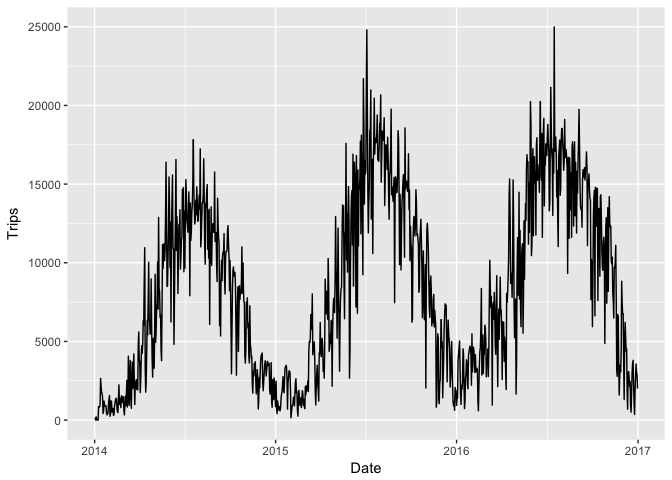
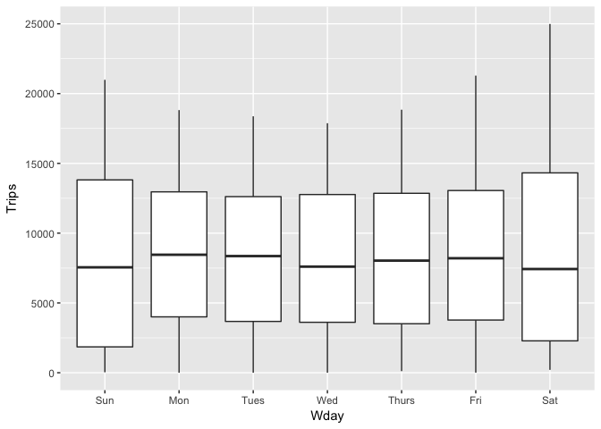
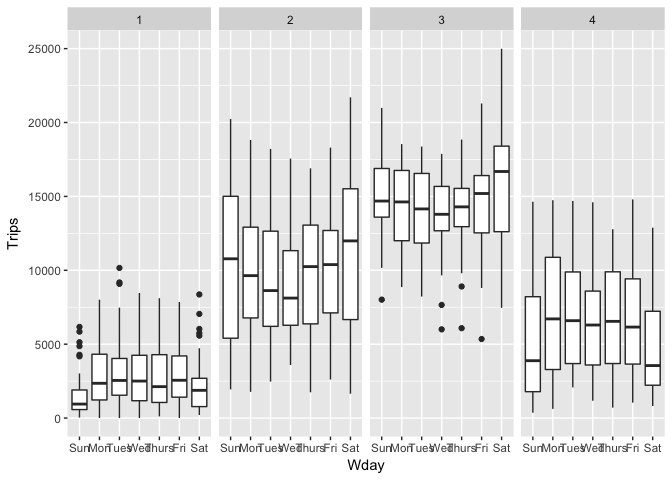
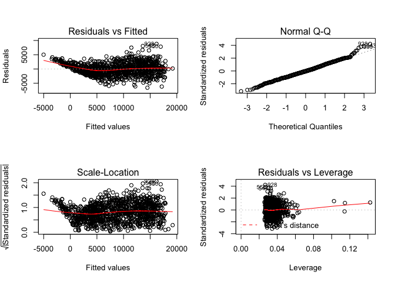
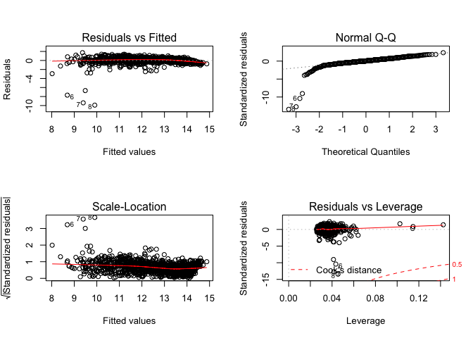
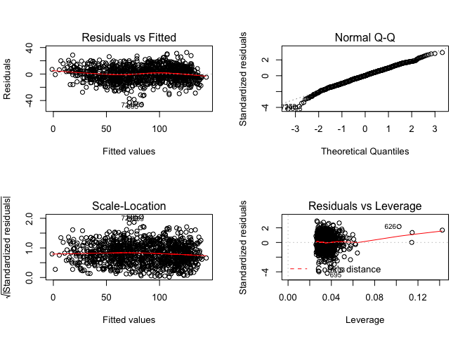
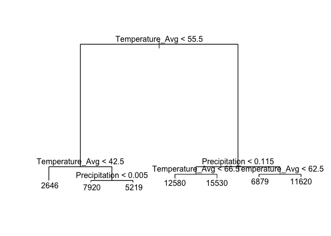
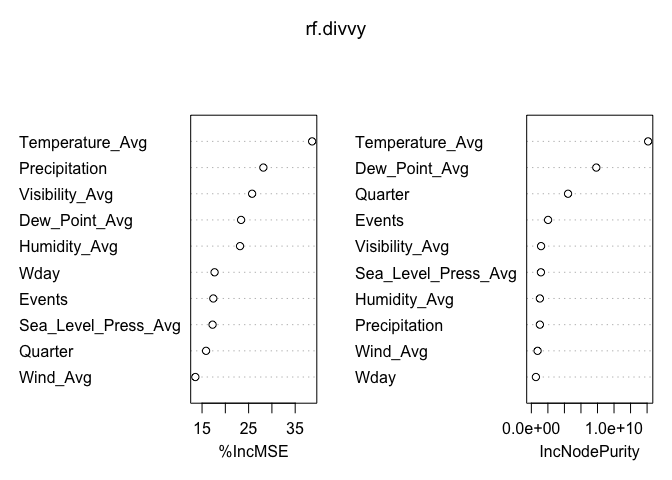
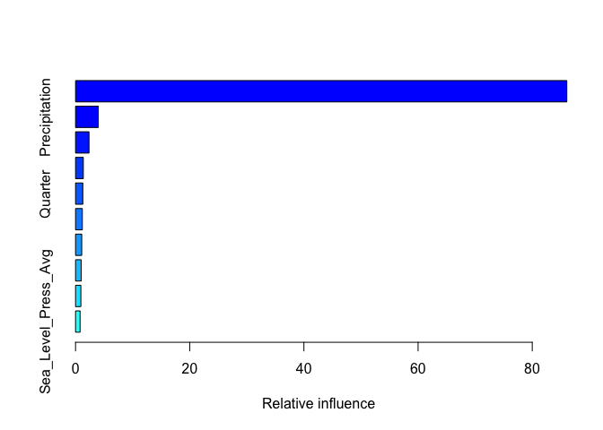

# Divvy
Sungwan Kim  
9/5/2017  


# Introduction

This is a prediction of bicycle sharing usage in the city of Chicago. I have defined the usage as the number of trips taken per day. I will use historical trips and weather datasets from 2014 to 2016 to predict the usage for the first half of 2017. I have decided to exclude trips data from 2013 as the number of rides during first few months are noticeably low as Divvy just started out its service in the Windy City.

### Load Data


```r
# Load packages
library('tidyverse')
library('lubridate')
library('leaps')
library('tree')
library('randomForest')
library('gbm')
```

To jump right into the Exploratory Data Analysis and Feature Engineering, I have written detailed data preparation at the end.


```r
train <- read_csv("train.csv")
test <- read_csv("test.csv")
```

```r
# check data
str(train)
```

```
## Classes 'tbl_df', 'tbl' and 'data.frame':	1096 obs. of  22 variables:
##  $ Date                : Date, format: "2014-01-01" "2014-01-02" ...
##  $ Temperature_High    : int  22 21 20 31 29 -2 3 17 27 40 ...
##  $ Temperature_Avg     : int  16 10 4 25 13 -9 -4 6 12 34 ...
##  $ Temperature_Low     : int  10 -1 -12 19 -3 -16 -12 -6 -4 27 ...
##  $ Dew_Point_High      : int  16 16 10 27 25 -17 -8 -3 23 36 ...
##  $ Dew_Point_Avg       : int  14 8 -1 21 7 -23 -15 -6 10 30 ...
##  $ Dew_Point_Low       : int  3 -11 -15 10 -15 -27 -21 -10 -10 23 ...
##  $ Humidity_High       : int  80 80 74 85 88 63 78 82 81 92 ...
##  $ Humidity_Avg        : int  76 71 63 71 71 56 65 62 71 87 ...
##  $ Humidity_Low        : int  71 61 52 57 53 49 51 42 61 82 ...
##  $ Sea_Level_Press_High: num  30.3 30.4 30.4 30 30.1 ...
##  $ Sea_Level_Press_Avg : num  30.2 30.2 30.3 29.9 30 ...
##  $ Sea_Level_Press_Low : num  30.2 30.1 29.9 29.8 29.9 ...
##  $ Visibility_High     : int  9 10 10 10 10 10 10 10 10 9 ...
##  $ Visibility_Avg      : int  3 4 9 4 2 10 10 10 6 3 ...
##  $ Visibility_Low      : int  0 0 5 0 0 9 10 7 2 1 ...
##  $ Wind_Avg            : int  20 22 35 27 31 28 18 10 14 20 ...
##  $ Wind_Low            : int  11 13 15 14 17 19 10 5 6 11 ...
##  $ Wind_High           : chr  "24" "26" "44" "40" ...
##  $ Precipitation       : num  0.25 0.22 0 0.26 0.59 0 0 0 0.01 0.8 ...
##  $ Events              : chr  "Snow" "Snow" "Snow" "Snow" ...
##  $ Trips               : int  123 112 6 205 33 1 NA NA 860 823 ...
##  - attr(*, "spec")=List of 2
##   ..$ cols   :List of 22
##   .. ..$ Date                :List of 1
##   .. .. ..$ format: chr ""
##   .. .. ..- attr(*, "class")= chr  "collector_date" "collector"
##   .. ..$ Temperature_High    : list()
##   .. .. ..- attr(*, "class")= chr  "collector_integer" "collector"
##   .. ..$ Temperature_Avg     : list()
##   .. .. ..- attr(*, "class")= chr  "collector_integer" "collector"
##   .. ..$ Temperature_Low     : list()
##   .. .. ..- attr(*, "class")= chr  "collector_integer" "collector"
##   .. ..$ Dew_Point_High      : list()
##   .. .. ..- attr(*, "class")= chr  "collector_integer" "collector"
##   .. ..$ Dew_Point_Avg       : list()
##   .. .. ..- attr(*, "class")= chr  "collector_integer" "collector"
##   .. ..$ Dew_Point_Low       : list()
##   .. .. ..- attr(*, "class")= chr  "collector_integer" "collector"
##   .. ..$ Humidity_High       : list()
##   .. .. ..- attr(*, "class")= chr  "collector_integer" "collector"
##   .. ..$ Humidity_Avg        : list()
##   .. .. ..- attr(*, "class")= chr  "collector_integer" "collector"
##   .. ..$ Humidity_Low        : list()
##   .. .. ..- attr(*, "class")= chr  "collector_integer" "collector"
##   .. ..$ Sea_Level_Press_High: list()
##   .. .. ..- attr(*, "class")= chr  "collector_double" "collector"
##   .. ..$ Sea_Level_Press_Avg : list()
##   .. .. ..- attr(*, "class")= chr  "collector_double" "collector"
##   .. ..$ Sea_Level_Press_Low : list()
##   .. .. ..- attr(*, "class")= chr  "collector_double" "collector"
##   .. ..$ Visibility_High     : list()
##   .. .. ..- attr(*, "class")= chr  "collector_integer" "collector"
##   .. ..$ Visibility_Avg      : list()
##   .. .. ..- attr(*, "class")= chr  "collector_integer" "collector"
##   .. ..$ Visibility_Low      : list()
##   .. .. ..- attr(*, "class")= chr  "collector_integer" "collector"
##   .. ..$ Wind_Avg            : list()
##   .. .. ..- attr(*, "class")= chr  "collector_integer" "collector"
##   .. ..$ Wind_Low            : list()
##   .. .. ..- attr(*, "class")= chr  "collector_integer" "collector"
##   .. ..$ Wind_High           : list()
##   .. .. ..- attr(*, "class")= chr  "collector_character" "collector"
##   .. ..$ Precipitation       : list()
##   .. .. ..- attr(*, "class")= chr  "collector_double" "collector"
##   .. ..$ Events              : list()
##   .. .. ..- attr(*, "class")= chr  "collector_character" "collector"
##   .. ..$ Trips               : list()
##   .. .. ..- attr(*, "class")= chr  "collector_integer" "collector"
##   ..$ default: list()
##   .. ..- attr(*, "class")= chr  "collector_guess" "collector"
##   ..- attr(*, "class")= chr "col_spec"
```

There are few missing values in our training data set. These are from the days when there were no trips, so we input the adequate values accordingly.


```r
which(is.na(train$Trips))
```

```
## [1] 7 8
```

```r
train[which(is.na(train$Trips)),]$Trips <- 0
```


## Feature Engineering

Let's shed more light into what is driving the Divvy usage. First, I will define usage to be the number of trips taken per day.


```r
ggplot(train, aes(Date, Trips)) + geom_line()
```

<!-- -->

The graph shows strong seasonal pattern. I will create a variable called quarter so that our models can capture this pattern when predicting.


```r
train$Quarter <- 1
train$Quarter[month(train$Date) %in% 4:6] <- 2
train$Quarter[month(train$Date) %in% 7:9] <- 3
train$Quarter[month(train$Date) %in% 10:12] <- 4
train$Quarter <- as.factor(train$Quarter)
```

I will create day of the week variable to see the shorter usage pattern.


```r
train <- train %>% 
  mutate(Wday = wday(Date, label = TRUE))
ggplot(train, aes(Wday, Trips)) + geom_boxplot()
```

<!-- -->

It seems like usage during week days are little higher than usage during weekends.


```r
train %>% 
  ggplot(aes(Wday, Trips)) +
    geom_boxplot() +
    facet_grid(.~Quarter)
```

<!-- -->

It seems like the usage for day of the week vary for different quarters.

We add the same feature engineered variables to our test set.


```r
test <- test %>% 
  mutate(Wday = wday(Date, label = TRUE))
test$Quarter <- 1
test$Quarter[month(test$Date) %in% 4:6] <- 2
test$Quarter[month(test$Date) %in% 7:9] <- 3
test$Quarter[month(test$Date) %in% 10:12] <- 4
test$Quarter <- as.factor(test$Quarter)
levels(test$Quarter) <- levels(train$Quarter)
```

# Prediction

### Linear Regression

I will first use linear regression as a starting point.


```r
lm.fit <- lm(Trips ~ Temperature_Avg + Dew_Point_Avg + Humidity_Avg + Sea_Level_Press_Avg + Visibility_Avg + Wind_Avg + Precipitation + Events + Wday + Quarter, train)
summary(lm.fit)
```

```
## 
## Call:
## lm(formula = Trips ~ Temperature_Avg + Dew_Point_Avg + Humidity_Avg + 
##     Sea_Level_Press_Avg + Visibility_Avg + Wind_Avg + Precipitation + 
##     Events + Wday + Quarter, data = train)
## 
## Residuals:
##     Min      1Q  Median      3Q     Max 
## -6464.3 -1519.0   -82.4  1358.1 10185.9 
## 
## Coefficients:
##                      Estimate Std. Error t value Pr(>|t|)    
## (Intercept)         -47529.92   13007.28  -3.654 0.000271 ***
## Temperature_Avg        149.55      32.22   4.641 3.89e-06 ***
## Dew_Point_Avg           85.61      34.08   2.512 0.012154 *  
## Humidity_Avg           -57.27      16.57  -3.456 0.000570 ***
## Sea_Level_Press_Avg   1631.96     421.29   3.874 0.000114 ***
## Visibility_Avg         114.50      54.89   2.086 0.037213 *  
## Wind_Avg               -60.46      13.43  -4.503 7.44e-06 ***
## Precipitation        -2010.03     315.96  -6.362 2.95e-10 ***
## EventsRain           -1516.14     197.17  -7.690 3.32e-14 ***
## EventsSnow             345.12     251.61   1.372 0.170461    
## EventsThunderstorm   -1427.29     295.33  -4.833 1.54e-06 ***
## Wday.L                 330.39     175.75   1.880 0.060400 .  
## Wday.Q                -425.66     176.47  -2.412 0.016026 *  
## Wday.C                 264.97     175.30   1.512 0.130955    
## Wday^4                -204.36     175.56  -1.164 0.244655    
## Wday^5                 -96.80     175.43  -0.552 0.581206    
## Wday^6                  -1.07     174.87  -0.006 0.995118    
## Quarter2               742.54     273.36   2.716 0.006707 ** 
## Quarter3              2061.96     325.24   6.340 3.38e-10 ***
## Quarter4               407.56     217.74   1.872 0.061510 .  
## ---
## Signif. codes:  0 '***' 0.001 '**' 0.01 '*' 0.05 '.' 0.1 ' ' 1
## 
## Residual standard error: 2187 on 1076 degrees of freedom
## Multiple R-squared:  0.8517,	Adjusted R-squared:  0.8491 
## F-statistic: 325.3 on 19 and 1076 DF,  p-value: < 2.2e-16
```

The p-value associated with the F-statistics suggest that we can reject the null hypothesis. This means at least one of the regressors are is associated with the increase in usage. The model has found temperature, sea level pressure, wind, precipitation, rain, thunderstorm, and quarter2 to be significant. R-squared is 0.6451 which means large portion of the variance is explained by our model.

So, how did our model do in terms of prediction? I have used Root Mean Squared Error(RMSE) which is a popular metric for assessing model accuracy. 


```r
# RMSE
(RMSE <- sqrt(mean((test$Trips - predict(lm.fit, test))^2)))
```

```
## [1] 2476.261
```

The linear model has a root mean squared error(RMSE) of 2476.261.

We might want to have an interaction term between day of the week and quarter variables as we have confirmed above that the usage differ by weekdays for different quarters.


```r
lm.fit2 <- lm(Trips ~ Temperature_Avg + Dew_Point_Avg + Humidity_Avg + Sea_Level_Press_Avg + Visibility_Avg + Wind_Avg + Precipitation + Events + Wday * Quarter, train)
summary(lm.fit2)
```

```
## 
## Call:
## lm(formula = Trips ~ Temperature_Avg + Dew_Point_Avg + Humidity_Avg + 
##     Sea_Level_Press_Avg + Visibility_Avg + Wind_Avg + Precipitation + 
##     Events + Wday * Quarter, data = train)
## 
## Residuals:
##     Min      1Q  Median      3Q     Max 
## -6569.8 -1371.7   -82.7  1331.6  8792.8 
## 
## Coefficients:
##                      Estimate Std. Error t value Pr(>|t|)    
## (Intercept)         -53590.03   12709.89  -4.216 2.69e-05 ***
## Temperature_Avg        145.76      31.49   4.628 4.14e-06 ***
## Dew_Point_Avg           92.11      33.33   2.764 0.005811 ** 
## Humidity_Avg           -59.93      16.17  -3.706 0.000221 ***
## Sea_Level_Press_Avg   1840.76     411.57   4.473 8.56e-06 ***
## Visibility_Avg         104.26      53.64   1.944 0.052214 .  
## Wind_Avg               -58.82      13.09  -4.495 7.71e-06 ***
## Precipitation        -1920.86     307.17  -6.253 5.82e-10 ***
## EventsRain           -1530.36     192.45  -7.952 4.69e-15 ***
## EventsSnow             352.71     244.92   1.440 0.150144    
## EventsThunderstorm   -1504.48     288.92  -5.207 2.30e-07 ***
## Wday.L                -229.07     340.56  -0.673 0.501332    
## Wday.Q               -1760.17     341.51  -5.154 3.04e-07 ***
## Wday.C                 290.49     340.74   0.853 0.394105    
## Wday^4                -276.13     341.19  -0.809 0.418526    
## Wday^5                -117.68     341.03  -0.345 0.730100    
## Wday^6                -123.42     342.21  -0.361 0.718427    
## Quarter2               703.57     264.70   2.658 0.007979 ** 
## Quarter3              2000.04     314.84   6.353 3.14e-10 ***
## Quarter4               379.82     210.64   1.803 0.071642 .  
## Wday.L:Quarter2       1121.35     481.04   2.331 0.019935 *  
## Wday.Q:Quarter2       2290.95     482.81   4.745 2.37e-06 ***
## Wday.C:Quarter2       -241.91     483.11  -0.501 0.616667    
## Wday^4:Quarter2        366.17     481.64   0.760 0.447266    
## Wday^5:Quarter2        116.57     481.62   0.242 0.808801    
## Wday^6:Quarter2        332.94     481.21   0.692 0.489159    
## Wday.L:Quarter3       1225.47     481.84   2.543 0.011122 *  
## Wday.Q:Quarter3       3189.15     480.07   6.643 4.90e-11 ***
## Wday.C:Quarter3       -201.58     480.29  -0.420 0.674790    
## Wday^4:Quarter3        314.40     479.68   0.655 0.512327    
## Wday^5:Quarter3         56.10     479.02   0.117 0.906799    
## Wday^6:Quarter3        119.49     480.55   0.249 0.803682    
## Wday.L:Quarter4       -121.25     481.64  -0.252 0.801284    
## Wday.Q:Quarter4       -186.00     481.71  -0.386 0.699485    
## Wday.C:Quarter4        375.78     480.43   0.782 0.434291    
## Wday^4:Quarter4       -367.28     480.63  -0.764 0.444947    
## Wday^5:Quarter4       -109.44     479.73  -0.228 0.819588    
## Wday^6:Quarter4         48.82     481.45   0.101 0.919247    
## ---
## Signif. codes:  0 '***' 0.001 '**' 0.01 '*' 0.05 '.' 0.1 ' ' 1
## 
## Residual standard error: 2115 on 1058 degrees of freedom
## Multiple R-squared:  0.8637,	Adjusted R-squared:  0.8589 
## F-statistic: 181.2 on 37 and 1058 DF,  p-value: < 2.2e-16
```

```r
#RMSE
sqrt(mean((test$Trips - predict(lm.fit2, test))^2))
```

```
## [1] 2453.999
```

We did a little better in terms of the prediction.

One possible problem of the linear regression is non-constant variances in the errors, or heteroscedasticity. The residuals plot has a funnel shape which implies heteroskedasticity.


```r
par(mfrow=c(2,2))
plot(lm.fit2)
```

<!-- -->

We can solve heteroskedasticity by log transformation. Since we have two trips value with 0, we cannot take log straight away. One way to bypass this problem is to add 1.


```r
lm.fit3 <- lm(log2(Trips+1) ~ Temperature_Avg + Dew_Point_Avg + Humidity_Avg + Sea_Level_Press_Avg + Visibility_Avg + Wind_Avg + Precipitation + Events + Wday * Quarter, train)
par(mfrow=c(2,2))
plot(lm.fit3)

# RMSE
sqrt(mean((test$Trips - 2^(predict(lm.fit3, test))-1)^2))
```

```
## [1] 2931.344
```

<!-- -->

We treated heteroskedasticity, but the prediction result suffered as RMSE score skyrocketed. Another way to treat heteroskedasticy would be using square root.


```r
lm.fit4 <- lm(sqrt(Trips) ~ Temperature_Avg + Dew_Point_Avg + Humidity_Avg + Sea_Level_Press_Avg + Visibility_Avg + Wind_Avg + Precipitation + Events + Wday * Quarter, train)
par(mfrow=c(2,2))
plot(lm.fit4)

# RMSE
sqrt(mean((test$Trips - predict(lm.fit4, test)^2)^2))
```

```
## [1] 2417.494
```

<!-- -->

We have done better than our orignial linear model! We have found a model which is both more accurate and robust.

To choose the optimal model with right numbers of varaibles we will consdier Adjusted R-squared, Bayesian information criterion(BIC), and Cp.


```r
regfit.full <- regsubsets(sqrt(Trips) ~ Temperature_Avg + Dew_Point_Avg + Humidity_Avg + Sea_Level_Press_Avg + Visibility_Avg + Wind_Avg + Precipitation + Events + Wday * Quarter, train)
reg.summary <- summary(regfit.full)
# R-squared statistic always increase with additional variable
reg.summary$rsq
```

```
## [1] 0.8044529 0.8423886 0.8573252 0.8648190 0.8699690 0.8741087 0.8781127
## [8] 0.8818625
```

```r
# plotting RSS, adjusted R-squared, Cp, and BIC
par(mfrow=c(2,2))
plot(reg.summary$rss, xlab="Number of Variables", ylab="RSS", type="l")
plot(reg.summary$adjr2, xlab="Number of Variables", ylab="Adjusted RSq", type="l")
which.max(reg.summary$adjr2)
```

```
## [1] 8
```

```r
points(8, reg.summary$adjr2[8], col = "red", cex = 2, pch = 20)
plot(reg.summary$cp, xlab="Number of Variables", ylab="Cp", type="l")
which.min(reg.summary$cp)
```

```
## [1] 8
```

```r
points(8, reg.summary$cp[8], col = "red", cex = 2, pch = 20)
plot(reg.summary$bic, xlab="Number of Variables", ylab="BIC", type="l")
which.min(reg.summary$bic)
```

```
## [1] 8
```

```r
points(8, reg.summary$bic[8], col = "red", cex = 2, pch = 20)
```

<!-- -->

It is clear that using all 8 regressors is the right way to go.

### Decision Trees

Next, we consider the decision trees model to predict the usage. Among many advantages of decision trees is its high interpretability.


```r
# set random seed
set.seed(11)
tree.divvy <- tree(Trips ~ Temperature_Avg + Dew_Point_Avg + Humidity_Avg + Sea_Level_Press_Avg + Visibility_Avg + Wind_Avg + Precipitation + Events + Wday + Quarter, train)
```

```
## Warning in tree(Trips ~ Temperature_Avg + Dew_Point_Avg + Humidity_Avg + :
## NAs introduced by coercion
```

```r
summary(tree.divvy)
```

```
## 
## Regression tree:
## tree(formula = Trips ~ Temperature_Avg + Dew_Point_Avg + Humidity_Avg + 
##     Sea_Level_Press_Avg + Visibility_Avg + Wind_Avg + Precipitation + 
##     Events + Wday + Quarter, data = train)
## Variables actually used in tree construction:
## [1] "Temperature_Avg" "Precipitation"  
## Number of terminal nodes:  7 
## Residual mean deviance:  5291000 = 5.762e+09 / 1089 
## Distribution of residuals:
##    Min. 1st Qu.  Median    Mean 3rd Qu.    Max. 
## -6170.0 -1624.0  -124.5     0.0  1474.0  9455.0
```

```r
# plot tree
plot(tree.divvy)
text(tree.divvy, pretty = 0)
# RMSE
sqrt(mean((predict(tree.divvy, newdata = test) - test$Trips)^2))
```

```
## Warning in pred1.tree(object, tree.matrix(newdata)): NAs introduced by
## coercion
```

```
## [1] 2340.803
```

<!-- -->

We did better than linear models. We can do even better by using decision trees as building blocks to create powerful machine learning algorithms.

### Ensemble Models

In this section we will consider three ensembles models: Bagging, Random Forests, and Boosting.

We will first convert character vectors to factors so we can use randomForest.


```r
sapply(train, typeof)
```

```
##                 Date     Temperature_High      Temperature_Avg 
##             "double"            "integer"            "integer" 
##      Temperature_Low       Dew_Point_High        Dew_Point_Avg 
##            "integer"            "integer"            "integer" 
##        Dew_Point_Low        Humidity_High         Humidity_Avg 
##            "integer"            "integer"            "integer" 
##         Humidity_Low Sea_Level_Press_High  Sea_Level_Press_Avg 
##            "integer"             "double"             "double" 
##  Sea_Level_Press_Low      Visibility_High       Visibility_Avg 
##             "double"            "integer"            "integer" 
##       Visibility_Low             Wind_Avg             Wind_Low 
##            "integer"            "integer"            "integer" 
##            Wind_High        Precipitation               Events 
##          "character"             "double"          "character" 
##                Trips              Quarter                 Wday 
##             "double"            "integer"            "integer"
```

```r
sapply(test, typeof)
```

```
##                 Date     Temperature_High      Temperature_Avg 
##             "double"            "integer"            "integer" 
##      Temperature_Low       Dew_Point_High        Dew_Point_Avg 
##            "integer"            "integer"            "integer" 
##        Dew_Point_Low        Humidity_High         Humidity_Avg 
##            "integer"            "integer"            "integer" 
##         Humidity_Low Sea_Level_Press_High  Sea_Level_Press_Avg 
##            "integer"             "double"             "double" 
##  Sea_Level_Press_Low      Visibility_High       Visibility_Avg 
##             "double"            "integer"            "integer" 
##       Visibility_Low             Wind_Avg             Wind_Low 
##            "integer"            "integer"            "integer" 
##            Wind_High        Precipitation               Events 
##          "character"             "double"          "character" 
##                Trips                 Wday              Quarter 
##            "integer"            "integer"            "integer"
```

```r
train$Events <- as.factor(train$Events)
test$Events <- as.factor(test$Events)
```

Instead of using decision trees which suffers from high variance, we can use bootstrap aggregation or bagging to reduce the variance of a statistical learning method. Bagging takes repeated samples from our training set, grows hundreds of trees and averages all the predictions.


```r
set.seed(11)
bag.divvy <- randomForest(Trips ~ Temperature_Avg + Dew_Point_Avg + Humidity_Avg + Sea_Level_Press_Avg + Visibility_Avg + Wind_Avg + Precipitation + Events + Wday + Quarter, train, mtry = 9, importance = TRUE)
#RMSE
sqrt(mean((predict(bag.divvy, newdata = test) - test$Trips)^2))
```

```
## [1] 2025.091
```

Bagging result shows improved accuracy over a single tree. Bagging model is a special case of random forest when we use all the features available.

Random forests works similarly as bagging but instead decorrelates the individual trees by taking a random sample of predictors when building each tree. The default number of features is square root of the all available features which in this case is 3.


```r
rf.divvy <- randomForest(Trips ~ Temperature_Avg + Dew_Point_Avg + Humidity_Avg + Sea_Level_Press_Avg + Visibility_Avg + Wind_Avg + Precipitation + Events + Wday + Quarter, train, mtry=3, importance=TRUE)

# RMSE
sqrt(mean((predict(rf.divvy, newdata = test) - test$Trips)^2))
```

```
## [1] 2140.037
```

Let’s look at relative variable importance by plotting the mean decrease in Gini calculated across all trees. Temperature is by far the most important variable.


```r
importance(rf.divvy)
```

```
##                      %IncMSE IncNodePurity
## Temperature_Avg     38.63755   14125939864
## Dew_Point_Avg       23.38099    7855933189
## Humidity_Avg        23.15675    1032006482
## Sea_Level_Press_Avg 17.25799    1157880311
## Visibility_Avg      25.74976    1174614573
## Wind_Avg            13.56270     753031606
## Precipitation       28.16451    1031939036
## Events              17.42013    2020087470
## Wday                17.68867     550312622
## Quarter             15.86045    4437880465
```

```r
varImpPlot(rf.divvy)
```

<!-- -->

Boosting works similarly as bagging, but the trees are grown sequentially meaning it builds on top of what the previous trees have learned.


```r
set.seed(11)
boost.divvy <- gbm(Trips ~ Temperature_Avg + Dew_Point_Avg + Humidity_Avg + Sea_Level_Press_Avg + Visibility_Avg + Wind_Avg + Precipitation + Events + Wday + Quarter, train, distribution="gaussian", n.trees = 5000, interaction.depth = 4)
# summary() function produces a relative influence plot and relative influence statistics
summary(boost.divvy)
```

```
##                                     var    rel.inf
## Temperature_Avg         Temperature_Avg 86.0537187
## Precipitation             Precipitation  3.9754301
## Events                           Events  2.3553531
## Visibility_Avg           Visibility_Avg  1.3605502
## Quarter                         Quarter  1.2726593
## Dew_Point_Avg             Dew_Point_Avg  1.1916143
## Wday                               Wday  1.0816632
## Humidity_Avg               Humidity_Avg  0.9832046
## Wind_Avg                       Wind_Avg  0.9325863
## Sea_Level_Press_Avg Sea_Level_Press_Avg  0.7932202
```

```r
# RMSE
sqrt(mean((predict(boost.divvy, newdata = test,n.trees = 5000) - test$Trips)^2))
```

```
## [1] 2132.904
```

<!-- -->

# Conclusion

We have used linear regression, decision trees, bagging, random forests, and boosting models to predict the usage of Divvy. Ensemble models performed better than simple models like linear regression and decision trees. The RMSE associated with bagging is 2025.091 compared to that of a simple linear regression's 2476.261. We have to acknowledge that RMSE was important as our primary goal was prediction accuracy. If instead our goal was interpretability of the model, then linear regression and decision tree is far more interpretable than complex ensemble models.


## Data Preparation (Optional)

### Training Data Set


```r
trips_2014_Q1Q2 <- read_csv("Divvy_Trips_2014_Q1Q2.csv")
trips_2014_Q3_07 <- read_csv("Divvy_Trips_2014-Q3-07.csv")
trips_2014_Q3_0809 <- read_csv("Divvy_Trips_2014-Q3-0809.csv")
trips_2014_Q4 <- read_csv("Divvy_Trips_2014-Q4.csv")
trips_2015_Q1 <- read_csv("Divvy_Trips_2015-Q1.csv")
trips_2015_Q2 <- read_csv("Divvy_Trips_2015-Q2.csv")
trips_2015_Q3_07 <- read_csv("Divvy_Trips_2015_07.csv")
trips_2015_Q3_08 <- read_csv("Divvy_Trips_2015_08.csv")
trips_2015_Q3_09 <- read_csv("Divvy_Trips_2015_09.csv")
trips_2015_Q4 <- read_csv("Divvy_Trips_2015_Q4.csv")
trips_2016_Q1 <- read_csv("Divvy_Trips_2016_Q1.csv")
trips_2016_Q2_04 <- read_csv("Divvy_Trips_2016_04.csv")
trips_2016_Q2_05 <- read_csv("Divvy_Trips_2016_05.csv")
trips_2016_Q2_06 <- read_csv("Divvy_Trips_2016_06.csv")
trips_2016_Q3 <- read_csv("Divvy_Trips_2016_Q3.csv")
trips_2016_Q4 <- read_csv("Divvy_Trips_2016_Q4.csv")
trips_2017_Q1 <- read_csv("Divvy_Trips_2017_Q1.csv")
trips_2017_Q2 <- read_csv("Divvy_Trips_2017_Q2.csv")

trips <- rbind(trips_2014_Q1Q2, trips_2014_Q3_07, trips_2014_Q3_0809, trips_2014_Q4, 
               trips_2015_Q1, trips_2015_Q2, trips_2015_Q3_07, trips_2015_Q3_08,
               trips_2015_Q3_09, trips_2015_Q4, trips_2016_Q1, trips_2016_Q2_04,
               trips_2016_Q2_05, trips_2016_Q2_06)
trips$starttime <- as_date(mdy_hm(trips$starttime))
trips$stoptime <- as_date(mdy_hm(trips$stoptime))
# starttime and stoptime for 2016 Q3 & Q4 are formatted differently
trips_2016_Q3Q4 <- rbind(trips_2016_Q3, trips_2016_Q4)
trips_2016_Q3Q4$starttime <- as_date(mdy_hms(trips_2016_Q3Q4$starttime))
trips_2016_Q3Q4$stoptime <- as_date(mdy_hms(trips_2016_Q3Q4$stoptime))
trips <- rbind(trips, trips_2016_Q3Q4)

names(trips)[names(trips) == "starttime"] <- "Date"
byday <- trips %>% 
  group_by(Date) %>% 
  summarise(Trips = n())


weather <- read_csv("chicagoweather.csv")
# convert date
weather$Date <- as_date(dmy(weather$Date))

# "T" stands for "trace", used when precipitation has been detected, but it isn't sufficient to measure meaningfully
weather$Precipitation[weather$Precipitation == "T"] <- 0
weather$Precipitation <- as.numeric(weather$Precipitation)

# treating events variable
weather[which(is.na(weather$Events)),]$Events <- "None"
weather$Events <- as.factor(weather$Events)
levels(weather$Events)
weather$Events <- gsub("Fog|Fog\\r\\t,\\rRain|Rain", "Rain", weather$Events)
weather$Events <- gsub("Fog\\r\\t,\\rRain\\r\\t,\\rSnow|Fog\\r\\t,\\rSnow|Rain\\r\\t,\\rSnow|Snow", "Snow", weather$Events)
weather$Events <- gsub("Fog\\r\\t,\\rRain\\r\\t,\\rThunderstorm|Rain\\r\\t,\\rHail\\r\\t,\\rThunderstorm|Rain\\r\\t,\\rThunderstorm|Thunderstorm", "Thunderstorm", weather$Events)
weather$Events <- as.factor(weather$Events)
levels(weather$Events)

# merge and create our training dataset!
train <- weather %>% 
  left_join(byday, by = "Date")

# write csv
write.csv(train, file = "train.csv", row.names = FALSE)
```

### Testing Data Set

We do the same transformation to trips and weather data for 2017 to create our testing set.


```r
weather_2017 <- read_csv("chicagoweather2017.csv")
weather_2017$Date <- as_date(dmy(weather_2017$Date))
weather_2017[which(is.na(weather_2017$Precipitation)),]$Precipitation <- 0
weather_2017$Precipitation <- as.numeric(weather_2017$Precipitation)
weather_2017[which(is.na(weather_2017$Events)),]$Events <- "None"
weather_2017$Events <- as.factor(weather_2017$Events)
levels(weather_2017$Events)
weather_2017$Events <- gsub("Fog|Fog , Rain|Rain", "Rain", weather_2017$Events)
weather_2017$Events <- gsub("Fog , Rain , Snow|Fog , Snow|Rain , Snow|Snow", "Snow", weather_2017$Events)
weather_2017$Events <- gsub("Fog , Rain , Thunderstorm|Fog , Snow , Thunderstorm|Rain , Hail , Thunderstorm|Rain , Thunderstorm|Thunderstorm|Snow , Thunderstorm", "Thunderstorm", weather_2017$Events)
weather_2017$Events <- as.factor(weather_2017$Events)
levels(weather_2017$Events)

trips_2017_Q1 <- read_csv("Divvy_Trips_2017_Q1.csv")
trips_2017_Q2 <- read_csv("Divvy_Trips_2017_Q2.csv")
trips_2017 <- rbind(trips_2017_Q1, trips_2017_Q2)
trips_2017$Date <- as_date(mdy_hms(trips_2017$start_time))
byday2 <- trips_2017 %>% 
  group_by(Date) %>% 
  summarise(Trips = n())

test <- weather_2017 %>% 
  left_join(byday2, by = "Date")

write.csv(test, file = "test.csv", row.names = FALSE)
```
